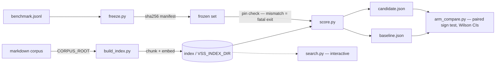

<div align=right>Table of Contents ↗️</div>

# frozen-ruler

[](https://github.com/adamcdowell/frozen-ruler/actions/workflows/ci.yml)


[](./LICENSE)

**Retrieval eval harness with frozen-benchmark discipline — a benchmark is only a ruler if it cannot move**

A retrieval evaluation harness for markdown knowledge bases — hybrid search
(dense embeddings + BM25 via reciprocal rank fusion, optional cross-encoder
rerank and a PageRank graph lane) with the evaluation discipline as the actual
product: frozen benchmark sets, drift refusal, per-class scoring, honest
statistics for small n.

Extracted from a production system I run daily over my own business's knowledge
base. The example corpus here is synthetic (a tiny espresso wiki); the design
decisions all come from real incidents, several of which are documented below.

## Pipeline



## Why "frozen"

Most retrieval demos re-generate their eval set whenever it's convenient, which
makes every number incomparable with the last one. This harness treats the
benchmark like an instrument:

- **The set is sha256-pinned** (`freeze.py` writes a manifest). `score.py`
  **fatal-exits** if the set no longer matches its pin — a modified ruler
  invalidates every stored comparison, so refusing to run is the correct
  behavior. Need to change the set? Cut a new versioned file.
- **Index provenance is stamped into every result** (model, chunk count, build
  time). Without this, a before/after comparison silently attributes *corpus
  drift* to the change under test. This is not hypothetical: a metadata
  writeback once re-embedded the corpus between two runs and moved every
  number; the drift warning in `--compare` exists because of that day.
- **Fully stale gold is reported loudly.** If ALL of an item's gold documents
  disappear from the index, the item is excluded and named in the output. An
  item whose gold set is only *partially* present is scored against the
  surviving subset — a documented trade-off that keeps long-lived sets usable
  across corpus churn (see the docstring in `score.py`).
- **A degraded lane is fatal, not a footnote.** If `--rerank` is requested and
  the cross-encoder fails, the scorer refuses to write results rather than
  emit RRF baseline numbers stamped `rerank: true`. Successful runs record
  `rerank_verified`. Interactive `search.py` still degrades gracefully — a
  missing model shouldn't stop you searching, only publishing a measurement.

## What it measures

- recall@k, F1@k (k = 1, 3, 5, 10), MRR@10 — at document level.
- **Per-class breakout** — the set carries a `category` per item (derived,
  synonym, cross-page, partial-recall, negative). A macro-average happily hides
  one class sitting at zero while the rest look fine; the per-class table is
  the whole point.
- **Negatives and abstention** — negative items (no correct answer in the
  corpus) are scored by a different rule, and the scorer reports the cosine
  separation AUC between positives and negatives: the probability that a random
  positive query's *best dense-cosine score* exceeds a random negative's. Note
  what this is and is not: it is a property of the **dense lane only**, measured
  before fusion, so it does not move when `--rerank` or `--graph` are on, and it
  is not the score of the note the pipeline finally ranks first. That is
  deliberate — RRF fused scores are rank-derived (~1/61 for every #1) and carry
  no relevance magnitude, so the fused ranking cannot supply this number at all.
  It tells you whether "return nothing rather than a bad answer" is even
  learnable from your retrieval scores. It is a measurement, not a gate: no
  threshold is applied anywhere in this harness.
- **Mega-document contamination** — the share of top-5 slots taken by the N
  largest documents when they aren't gold. Big append-style documents crowd out
  everything else; this makes the crowding visible.

## Honest statistics for small n

`arm_compare.py` compares two scored runs over the same frozen set with a
paired sign test (two-sided binomial), Wilson 95% CIs, and the discordant-pair
counts that drive the test — because at benchmark sizes like n=200, the honest
headline is usually "indistinguishable," and the tooling should make that easy
to say. It also prints which items flipped at recall@1 (up to six per direction),
so a flagged result can be read, not just believed.

Read the marker precisely: the sign test counts how many queries improved
versus regressed and discards the size of each move, so it tests *direction*,
not the mean delta printed beside it. Those two can disagree when a handful of
large moves dominate the mean — twenty queries each gaining one MRR rank while
one loses its top hit is a significant directional win and a negative mean.
`arm_compare.py` labels the marker as directional and flags that disagreement
explicitly rather than letting it be read as a claim about the average. Every
result below reports its discordant-pair counts for the same reason.

**Multiplicity.** A single run emits 5 headline tests plus 3 per query class —
20 on the v2 set. Labelling all of them "significant" at raw p<0.05 would be a
multiple-comparisons error, so one metric is declared primary *before the run*
(`FROZEN_PRIMARY_METRIC`, default `recall@5`) and is the only confirmatory test;
every other row is marked exploratory and carries a Holm-Bonferroni adjusted
p-value over the whole family that run emitted. Two things keep this from being
theatre: the recall@k tests are nested on the same paired items rather than
independent, so Holm over the full family is deliberately conservative, and the
two-sided sign test is discrete — it cannot reach p<0.05 until there are 6
discordant pairs (min p = 2/2^n), so small per-class cells are structurally
incapable of firing at all.

## Results from production use

Numbers below are from the private benchmark this was extracted from — a
59-item v1 frozen set, later re-cut as a 209-item v2 (189 scored positives +
negatives) with per-class structure. Not reproducible from the synthetic
example; the example corpus is six notes and scores are trivially high on it.

- **Adopted** bge-base over bge-small on evidence (v1 set, n=59): recall@5
  0.449 → 0.576, paired 9-improved / 0-regressed, p = 0.004. The weakest of the
  three calls, and I'll say so: it rests on one metric of five, recall@1 moved
  *against* it, and MRR was flat. It justified a change I wanted to make, which
  is exactly when a single significant metric deserves the least trust.
- **Rejected** bge-large twice (v2 set): no metric's paired sign test reached significance (min p = 0.34)
  and the synonym class *regressed* (recall@1 0.400 → 0.360). Documented so the
  question doesn't get re-litigated without a new model family.
- **Overturned my own feature** (v2 set): a graph-retrieval lane I had built,
  benchmarked favorably on the 59-item set, and blessed as an opt-in in my live
  search tool scored 0-better / 9-worse at recall@10 across 189 paired queries,
  p = 0.004 — with no metric improving anywhere in the run. Demoted it to
  not-recommended and kept the original favorable numbers under a HISTORICAL
  heading instead of deleting them. Elapsed time from blessing it to overturning
  it: one afternoon.

The harness exists so that decisions like these are forced by the numbers,
including when the numbers say your own idea was wrong.

## Quickstart

Requires Python 3.11+ (the pinned `numpy` floor). Dependencies are declared in
`pyproject.toml`, so with [uv](https://github.com/astral-sh/uv) there is no
environment to manage — or run `pip install -e .` once and drop the `uv run` prefix.

```bash
# 1. Build an index over the example corpus
CORPUS_ROOT=$PWD/example/corpus VSS_INDEX_DIR=$PWD/example/index uv run python3 build_index.py

# 2. Score the frozen example benchmark
CORPUS_ROOT=$PWD/example/corpus VSS_INDEX_DIR=$PWD/example/index uv run python3 score.py --set example/benchmark.jsonl --out baseline.json

# 3. Change something (here: the embedding model), rescore, compare the two arms
CORPUS_ROOT=$PWD/example/corpus VSS_INDEX_DIR=$PWD/example/index2 VSS_MODEL=BAAI/bge-small-en-v1.5 uv run python3 build_index.py
CORPUS_ROOT=$PWD/example/corpus VSS_INDEX_DIR=$PWD/example/index2 VSS_MODEL=BAAI/bge-small-en-v1.5 uv run python3 score.py --set example/benchmark.jsonl --out candidate.json
uv run python3 arm_compare.py baseline.json candidate.json base cand

# 4. Author your own set, then freeze it
uv run python3 freeze.py path/to/benchmark.jsonl

# Interactive search over the index
CORPUS_ROOT=$PWD/example/corpus VSS_INDEX_DIR=$PWD/example/index uv run python3 search.py "why do my shots run fast" --k 5
```

Point `CORPUS_ROOT` at any directory of markdown files to use your own corpus.

## Example output

Real output from the synthetic six-note example corpus — a **smoke test, not a
result**. Scores are trivially high on six notes; the production numbers are in
"Results from production use" above. What this shows is the *shape* of the
instrument, and step 3 is a worked example of it refusing to overclaim.

Scoring the frozen set (`score.py`, tail of the run):

```
[frozen-set OK] benchmark.jsonl sha256 e5181f5c3dfc… verified

PER-CLASS (the v2 payload — a macro-average hides a class at zero):
  cross-page      n=  2  r@1 0.500  r@5 1.000  r@10 1.000  MRR 1.000  misses 0
  derived         n=  3  r@1 1.000  r@5 1.000  r@10 1.000  MRR 1.000  misses 0
  partial-recall  n=  2  r@1 1.000  r@5 1.000  r@10 1.000  MRR 1.000  misses 0
  synonym         n=  2  r@1 1.000  r@5 1.000  r@10 1.000  MRR 1.000  misses 0

NEGATIVES n=2: top1-acceptable 0.00 · any5-acceptable 0.00
  cosine separation AUC 0.9444 (pos median 0.5954 vs neg median 0.5426; pos p10 0.5816 vs neg p90 0.5727)

mega-note contamination in top-5: 0.756 (share of non-gold top-5 slots taken by the 8 biggest notes)
```

Comparing two arms — bge-base baseline vs a bge-small candidate (`arm_compare.py`):

```
paired items: 9   base vs cand

FAMILY: 17 tests this run (5 headline + 3x4 per class). Primary metric: recall@5. Uncorrected p is reported for every row; only the primary is confirmatory, the rest are exploratory at Holm-adjusted p.

HEADLINE (all scored items)
  metric               base           cand  mean delta   sign test (direction only)
  recall@1           0.8889         0.6667  -0.2222     0up/  2dn p=0.5000 p_holm=1.0000
  recall@3           1.0000         1.0000  +0.0000     0up/  0dn p=1.0000 p_holm=1.0000
  recall@5           1.0000         1.0000  +0.0000     0up/  0dn p=1.0000 p_holm=1.0000
  recall@10          1.0000         1.0000  +0.0000     0up/  0dn p=1.0000 p_holm=1.0000
  mrr@10             1.0000         0.8889  -0.1111     0up/  2dn p=0.5000 p_holm=1.0000

ANY-HIT RATE @10 (Wilson 95% CI)
  base          : 9/9 = 1.000   CI [0.701, 1.000]
  cand          : 9/9 = 1.000   CI [0.701, 1.000]

PER CLASS (exploratory — hypothesis-generating, not confirmatory)

  [cross-page] n=2
    recall@1   0.5000 -> 0.5000  (+0.0000)   0up/ 0dn p=1.000 p_holm=1.000
    recall@5   1.0000 -> 1.0000  (+0.0000)   0up/ 0dn p=1.000 p_holm=1.000
    recall@10  1.0000 -> 1.0000  (+0.0000)   0up/ 0dn p=1.000 p_holm=1.000

  [derived] n=3
    recall@1   1.0000 -> 0.6667  (-0.3333)   0up/ 1dn p=1.000 p_holm=1.000
    recall@5   1.0000 -> 1.0000  (+0.0000)   0up/ 0dn p=1.000 p_holm=1.000
    recall@10  1.0000 -> 1.0000  (+0.0000)   0up/ 0dn p=1.000 p_holm=1.000

  [partial-recall] n=2
    recall@1   1.0000 -> 1.0000  (+0.0000)   0up/ 0dn p=1.000 p_holm=1.000
    recall@5   1.0000 -> 1.0000  (+0.0000)   0up/ 0dn p=1.000 p_holm=1.000
    recall@10  1.0000 -> 1.0000  (+0.0000)   0up/ 0dn p=1.000 p_holm=1.000

  [synonym] n=2
    recall@1   1.0000 -> 0.5000  (-0.5000)   0up/ 1dn p=1.000 p_holm=1.000
    recall@5   1.0000 -> 1.0000  (+0.0000)   0up/ 0dn p=1.000 p_holm=1.000
    recall@10  1.0000 -> 1.0000  (+0.0000)   0up/ 0dn p=1.000 p_holm=1.000

FLIPS at recall@1 (who actually moved)
  cand wins top-1 on 0, loses on 2
    - [derived] why does my shot run fast even though the grind is fine
    - [synonym] frothing technique for silky foam
```

**This is the point of the harness.** The smaller model looks clearly worse —
recall@1 drops 0.22 — and the sign test still returns **p=0.5000**, because two
losses out of nine paired items is not evidence at this sample size. A harness
that reported only the delta would have told you to ship a conclusion the data
does not support. The Wilson interval says the same thing from the other side:
9/9 gives `[0.701, 1.000]`, so "100% recall" on nine items is compatible with a
true rate near 70%. The FLIPS list is what you actually act on — two named
queries to go look at, not a number to argue about.

Statistics self-test (stdlib only, no install — this is what CI runs):

```
$ uv run python3 test_stats.py
test_stats: all assertions passed
```

## Benchmark set format

One JSON object per line:

```json
{"id": "syn001", "category": "synonym", "query": "frothing technique for silky foam", "gold_paths": ["milk steaming basics.md"]}
{"id": "neg001", "category": "negative", "query": "how do I roast green beans", "gold_paths": [], "acceptable_paths": []}
```

`gold_paths` are corpus-relative. A negative item is identified by its
`category: "negative"` label — not by its empty `gold_paths`, which are empty
by convention; `freeze.py` rejects a set where the two disagree.
Retrieval always returns k candidates, so a negative is judged by whether what
ranks on top is in `acceptable_paths`, and true abstention is a downstream
call built on the reported cosine separation.

## Design decisions worth stealing

- **Atomic index publish** — the manifest is the single commit marker: each
  build writes generation-stamped data files (`embeddings-<gen>.npy`,
  `chunks-<gen>.json`) that never overwrite the live pair, then one
  `os.replace` of `manifest.json` publishes them, so a reader sees the whole
  old snapshot or the whole new one. An earlier version replaced all three
  files in sequence, which is *not* an atomic snapshot: a same-count publish
  killed between the embeddings and chunks renames passed every load check
  while the new vectors sat against stale metadata.
- **Collapse guard** — once the index holds 50+ documents, the builder refuses
  to run if the corpus count drops >50% (cloud-storage eviction once made
  "publish an empty index with exit 0" a real failure mode).
- **Carry-forward on read failure** — a transiently unreadable file keeps its
  old vectors rather than silently vanishing from the index; mass read
  failures with no prior vectors to carry forward abort the build entirely.
- **Query-only instruction prefix** — the bge retrieval instruction is
  prepended to queries, never to passages.
- **Contextual chunk prefixes** — each indexed chunk carries a synthetic
  prefix (document title + opening sentence + heading path) on the *indexed*
  form; the stored display form keeps only the title/heading context.

## Tests

`uv run python3 test_stats.py` — exact checks on the hand-rolled statistics
(sign-test binomial p-values against closed-form values, Wilson interval
against reference constants, and the empty/degenerate guards).

These run in CI on every push across Python 3.11–3.14 on Linux, macOS and
Windows. The lane installs nothing: `test_stats.py` and `arm_compare.py` import
only the standard library, so the statistics are verifiable without touching the
~2 GB of torch that the indexing side needs. `sentence-transformers` and `numpy`
are dependencies of `build_index.py` / `score.py`, not of the maths.

## What this is not

Not a library, not a package, no API stability promise. It's a reference
implementation of an evaluation discipline: pin the ruler, stamp the
provenance, break out the classes, and let paired statistics tell you when
your improvement is actually noise.

## License

MIT © Adam McDowell — see [LICENSE](./LICENSE).
